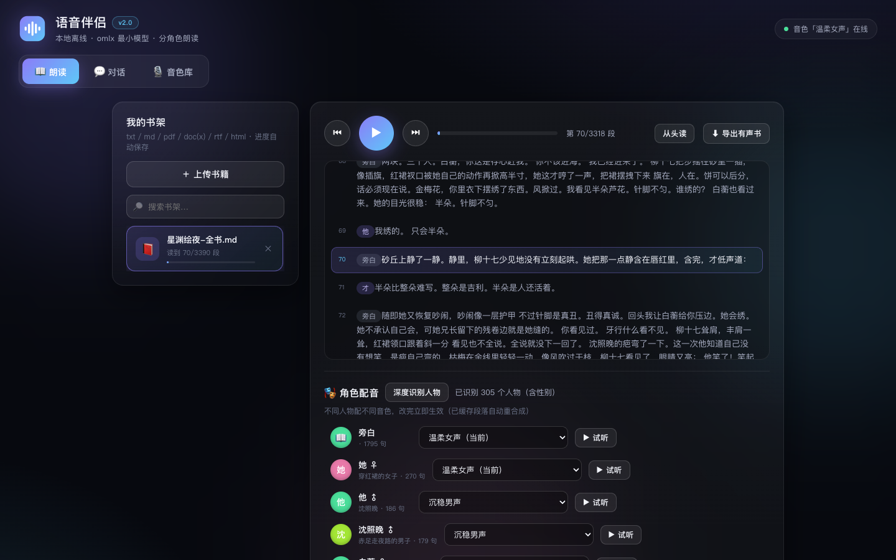
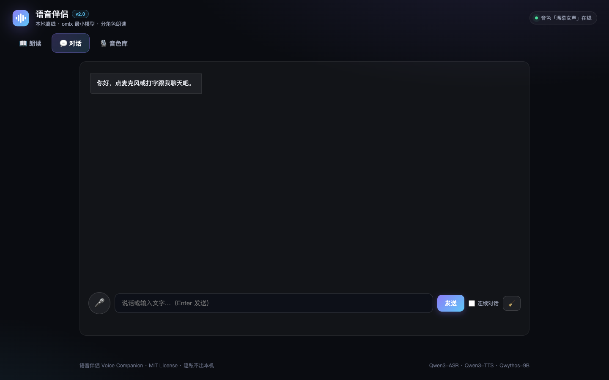
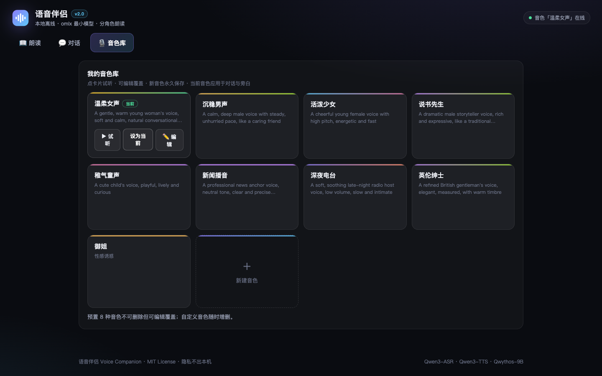

<div align="center">
  
  <h1>语音伴侣 · Voice Companion</h1>
  <p><strong>全离线本地朗读与对话软件</strong> —— 分角色听书 · 语音聊天 · 文字定制音色</p>
  <p>你的书、你的声音、你的对话，<strong>全部留在你的电脑上</strong>。</p>

  [](LICENSE)
  
  
  
  
</div>

---

语音识别、语音合成、对话模型全部运行在本机 [omlx](https://github.com/omlx-ai/omlx) 服务上，选用**同类最小的三个本地模型**，普通 Apple Silicon Mac 即可流畅运行：

| 环节 | 模型 | 参数量 |
|---|---|---|
| 语音识别 | `Qwen3-ASR-1.7B` | 1.7B |
| 语音合成 | `Qwen3-TTS-12Hz-1.7B-VoiceDesign` | 1.7B（音色可用文字描述） |
| 对话 | `Qwythos-9B` | 9B（本机最小的 LLM） |

> 无账号、无云端、无遥测。断开网络，它一样工作。

## 界面预览

| 📖 分角色朗读 | 💬 语音对话 | 🎙 音色库 |
|---|---|---|
|  |  |  |

## 隐私设计

这不是一句口号，是架构事实：

| 数据 | 存放位置 | 是否离开本机 |
|---|---|---|
| 你的书籍 | `books/` 文件夹 | ❌ 永远不会 |
| 听书进度 | `books/进度.json` | ❌ |
| 音色库 | `voices.json` | ❌ |
| 对话记忆 | 仅进程内存（重启即清空） | ❌ |
| 合成音频缓存 | `books/.cache/` | ❌ |

- 服务只监听 `127.0.0.1`，局域网都访问不到
- 无任何网络请求外发（唯一的网络活动是你要它下载公版书时）
- `books/` 与 `voices.json` 已被 git 忽略，**你的书永远不会被误传进仓库**

## 功能

- **📖 分角色朗读（听书）**
  - 支持 **txt / md / pdf / doc / docx / rtf / html**
  - 规则引擎把小说切成「旁白 / 角色 / 台词」，不同人物配不同音色——像广播剧一样听书
  - LLM 一键「深度识别人物」（含性别），自动按性别分配音色
  - 打开书即预取 3 段、播放中滚动预取，**点击即出声、连播无停顿**；点击任意段落跳读
  - 进度自动记忆，换音色后缓存自动失效重新合成
  - 一键**导出整本有声书 mp3**；2.9 万段的长篇渲染仅 3 秒，滚动满帧
- **💬 语音对话**
  - 点麦克风说话：录音 → 识别 → 回复 → 朗读，一气呵成；勾选**连续对话**后自动轮流
  - **回复带人物对话时自动分角色朗读**：切分成「旁白/角色/台词」，每个角色不同音色、逐句高亮
  - 保留最近 20 轮记忆，可一键清空；也可以直接打字
- **🎙 音色定制（VoiceDesign 的核心玩法）**
  - 8 种预置音色 + 自定义描述，**用中文写一句话就能创造新音色**：
    > `低沉磁性的大叔音，慢慢说话` · `像闺蜜一样轻快亲切的女声` · `严肃的老教授在讲课的语气`
  - 先试听再保存，语速 0.5~1.5 可调；对话与朗读共用音色库

## 环境与设置

### 硬件

- macOS + **Apple Silicon**（M1/M2/M3/M4）——模型基于 MLX，Intel Mac 无法运行
- 建议 16GB 内存（三个最小模型同时加载约需 12GB）

### 软件依赖（共 3 样）

| 依赖 | 用途 | 安装 |
|---|---|---|
| [omlx](https://github.com/omlx-ai/omlx) | 本地模型服务（ASR/TTS/LLM 的引擎） | 下载 omlx.app 拖入 Applications |
| Python 3.10+ | 运行本软件（**零 pip 依赖**，仅标准库） | `brew install python3` |
| ffmpeg | 浏览器录音转码 + 有声书导出 | `brew install ffmpeg` |

### 必要设置（首次使用按顺序）

**1. 启动 omlx 并加载三个模型**

打开 omlx 应用，确认服务运行（默认 `http://127.0.0.1:8880`），在模型管理里加载：

- `Qwen3-ASR-1.7B-bf16`
- `Qwen3-TTS-12Hz-1.7B-VoiceDesign-bf16`
- `Qwythos-9B-Claude-Mythos-5-1M-mxfp4-mlx`（或任意你喜欢的本地 LLM，改 `config.json` 的 `chat_model` 即可）

**2. 启动语音伴侣**

```bash
git clone https://github.com/c1818912073-cherner/voice-companion.git && cd voice-companion
python3 web_server.py            # 打开 http://127.0.0.1:8890
```

macOS 也可以直接双击 `启动Web语音伴侣.command`。页面右上角出现绿色"音色xxx在线"即全部就绪。

**3. 授权麦克风（对话功能需要）**

首次点麦克风时浏览器会弹授权，请选"允许"。如果没弹或误拒：系统设置 → 隐私与安全性 → 麦克风 → 给你的浏览器打勾。

**4. （可选）自检**

```bash
python3 voice_companion.py --selftest   # 全链路试音，会外放两句
```

## 书籍从哪来

书完全由你自己掌控，三种途径，全部本地：

**① 一键下载公版经典**——仓库自带脚本，从维基文库下载已进入公有领域的全文（可自由使用）：

```bash
python3 tools/fetch_classics.py            # 四大名著 + 老残游记/官场现形记/儒林外史/聊斋志异
python3 tools/fetch_classics.py 聊斋       # 只抓某本，断点续抓
```

**② Web 页上传**——朗读页点「上传书籍」，支持 txt / md / pdf / doc / docx / rtf / html。

**③ 直接放文件夹**——把文件拷进 `books/` 目录即可（文件名随意）。

> ⚠️ 版权提醒：请只导入你有权使用的书籍。本项目是本地工具，仓库与服务器不接触你的书籍内容；但**你自己不要**把受版权保护的书分享到网上。

## 工作原理

```
┌─────────────┐   HTTP    ┌──────────────────┐   OpenAI 兼容 API   ┌────────────┐
│  web/ 前端   │ ────────▶ │   web_server.py   │ ─────────────────▶ │   omlx     │
│ (浏览器 UI)  │ ◀──────── │ (音色/书籍/缓存)   │ ◀───────────────── │ 本地模型服务 │
└─────────────┘  wav/json └───────┬──────────┘   ASR / TTS / Chat   └────────────┘
                                  │ 复用
                    ┌─────────────┴──────────┐
                    │  voice_companion.py     │  录音 / 识别 / 合成 / 对话 / 进度
                    │  novel_engine.py        │  小说分角色切分 + 人物识别
                    └─────────────────────────┘
```

- **novel_engine.py**：纯正则把小说文本切成「说话人 + 台词」（支持"说道/曰/謂"等现代与文言动词，自动治理"韩立神色"这类残名）；`build_characters()` 用一次 LLM 调用识别人物与性别（结果缓存，可离线跳过）
- **web_server.py**：标准库 `ThreadingHTTPServer`，零依赖；按「书籍内容哈希 + 音色签名」缓存合成音频；POST 请求统一消费请求体，keep-alive 无粘连
- **前端**：单 HTML 文件，无构建无框架；分片渲染支持 3 万段长书；手势暖机绕过浏览器自动播放拦截

## HTTP API

`web_server.py` 同时是一个可独立使用的本地 API 服务：

| 方法 | 路径 | 说明 |
|---|---|---|
| GET | `/api/state` | 音色库 / 书架 / 当前模型 |
| GET | `/api/book?path=…` | 书籍脚本（台词行 + 人物 + 进度） |
| POST | `/api/book/analyze` | 深度识别人物（LLM，一次） |
| POST | `/api/book/cast` | 保存角色 → 音色映射 |
| POST | `/api/segment` | 合成指定段落（wav，带缓存） |
| POST | `/api/tts` ` /api/asr` ` /api/chat` | 合成 / 识别 / 对话 |
| POST | `/api/script` | 任意文本切分为「说话人+台词」（对话分角色朗读用） |
| POST | `/api/export` | 导出整本有声书 mp3（异步任务） |
| POST | `/api/books/upload` ` /api/books/delete` | 上传 / 删除书籍 |
| POST | `/api/voices/save` ` /delete` ` /current` | 音色库管理 |

## 配置（config.json）

| 键 | 说明 |
|---|---|
| `base_url` | omlx 服务地址，默认 `http://127.0.0.1:8880/v1` |
| `voice` | 当前音色（Web 页签里改更方便） |
| `segment_max_chars` | 朗读分段长度，默认 280 字 |
| `prefetch_segments` | 预合成段数，内存紧张可降为 2 |
| `chat_model` | 想更聪明可换更大的模型（如 `Qwen3.6-35B-A3B-4bit`） |

## 常见问题

**页面全红/无响应？** 八成是 omlx 没在跑——打开 omlx 应用，确认 8880 端口服务正常。

**没声音？** 检查系统音量和浏览器标签页是否静音；若状态栏提示"播放被浏览器拦截"，点一下页面任意位置即可（浏览器自动播放策略，点过一次后不再拦截）。

**对话一直自己聊下去？** 取消勾选"连续对话"即终止；没听清或播放被拦时循环也会自动停止。

**麦克风没反应？** 系统设置 → 隐私与安全性 → 麦克风，给浏览器授权后刷新页面。

**端口被占用？** `python3 web_server.py 8891` 换端口，或 `lsof -ti:8890 | xargs kill`。

**朗读暂停后继续为什么从段首重播？** 系统播放器不支持从中途续播，这是已知限制。

## 项目结构

```
voice-companion/
├── web_server.py        # Web 服务器 + HTTP API（标准库）
├── voice_companion.py   # 终端版 + 核心能力（录音/识别/合成/对话）
├── novel_engine.py      # 小说分角色切分 + 人物识别
├── web/index.html       # 单页前端（无构建、无框架）
├── tools/fetch_classics.py  # 公版经典下载器（维基文库 → books/）
├── config.json          # 默认配置
├── books/               # 书库与听书进度（git 忽略，你的书不进仓库）
├── docs/screenshots/    # README 截图
└── 启动*.command         # macOS 双击启动
```

## 终端版

```bash
python3 voice_companion.py --selftest   # 自检（外放两句试音）
python3 voice_companion.py              # 菜单
python3 voice_companion.py --chat       # 直接进对话
python3 voice_companion.py --read 路径/书.txt
```

## 版权与商用

| 内容 | 权利状态 |
|---|---|
| 本仓库代码 | [MIT](LICENSE)，可自由商用 |
| `tools/fetch_classics.py` 下载的经典原文 | 明代/清代作品，**已进入公有领域**（文本取自维基文库） |
| 你自己上传到 `books/` 的书 | 版权归原作者所有；仅在本机离线使用 |

## Roadmap

- [ ] 章节导航 / 书签
- [ ] 更多格式目录解析（epub）
- [ ] 声音克隆（给定参考音频定制音色）
- [ ] 对话内容导出

## License

[MIT](LICENSE) · 欢迎提 Issue 和 PR
